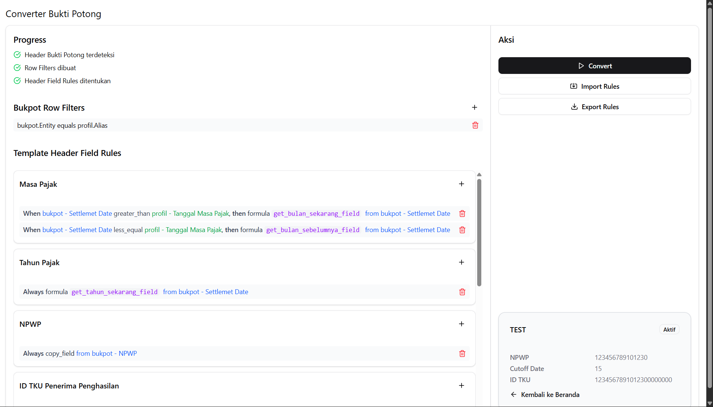

# Converter Bukti Potong




## Contoh hasil struktur:

```json
{
  "rowFilters": [
    {
      "source": "bukpot",
      "field": "Entity",
      "clause": "equals",
      "compareWith": {
        "type": "profil",
        "value": "Alias"
      }
    }
  ],
  "fieldRules": [
    {
      "header": "Masa Pajak",
      "rules": [
        {
          "type": "conditional",
          "when": {
            "source": "profil",
            "field": "Tanggal Masa Pajak",
            "clause": "greater_than",
            "compareWith": {
              "type": "set_value",
              "value": "15"
            }
          },
          "then": {
            "action": "formula",
            "formula": "bulan_sekarang"
          }
        },
        {
          "type": "conditional",
          "when": {
            "source": "profil",
            "field": "Tanggal Masa Pajak",
            "clause": "less_equal",
            "compareWith": {
              "type": "set_value",
              "value": "15"
            }
          },
          "then": {
            "action": "formula",
            "formula": "bulan_sebelumnya"
          }
        }
      ]
    },
    {
      "header": "Tahun Pajak",
      "rules": [
        {
          "type": "direct",
          "then": {
            "action": "formula",
            "formula": "tahun_sekarang"
          }
        }
      ]
    },
    {
      "header": "NPWP",
      "rules": [
        {
          "type": "direct",
          "then": {
            "action": "copy_field",
            "from": {
              "source": "bukpot",
              "field": "NPWP"
            }
          }
        }
      ]
    },
    {
      "header": "ID TKU Penerima Penghasilan",
      "rules": [
        {
          "type": "direct",
          "then": {
            "action": "copy_field",
            "from": {
              "source": "bukpot",
              "field": "NITKU"
            }
          }
        }
      ]
    },
    {
      "header": "Fasilitas",
      "rules": [
        {
          "type": "direct",
          "then": {
            "action": "set_value",
            "value": "N/A"
          }
        }
      ]
    },
    {
      "header": "Kode Objek Pajak",
      "rules": [
        {
          "type": "direct",
          "then": {
            "action": "copy_field",
            "from": {
              "source": "bukpot",
              "field": "Kode Objek Pajak"
            }
          }
        }
      ]
    },
    {
      "header": "DPP",
      "rules": [
        {
          "type": "direct",
          "then": {
            "action": "copy_field",
            "from": {
              "source": "bukpot",
              "field": "(Rp)Total Invoice (Exc VAT)"
            }
          }
        }
      ]
    },
    {
      "header": "Tarif",
      "rules": [
        {
          "type": "direct",
          "then": {
            "action": "copy_field",
            "from": {
              "source": "bukpot",
              "field": "WHT"
            }
          }
        }
      ]
    },
    {
      "header": "Jenis Dok. Referensi",
      "rules": [
        {
          "type": "conditional",
          "when": {
            "source": "bukpot",
            "field": "Faktur Pajak No",
            "clause": "not_empty",
            "compareWith": {
              "type": "",
              "value": ""
            }
          },
          "then": {
            "action": "set_value",
            "value": "TaxInvoice"
          }
        },
        {
          "type": "conditional",
          "when": {
            "source": "bukpot",
            "field": "Faktur Pajak No",
            "clause": "empty_or_zero",
            "compareWith": {
              "type": "",
              "value": ""
            }
          },
          "then": {
            "action": "set_value",
            "value": "CommercialInvoice"
          }
        }
      ]
    },
    {
      "header": "Nomor Dok. Referensi",
      "rules": [
        {
          "type": "conditional",
          "when": {
            "source": "bukpot",
            "field": "Faktur Pajak No",
            "clause": "not_empty",
            "compareWith": {
              "type": "",
              "value": ""
            }
          },
          "then": {
            "action": "copy_field",
            "from": {
              "source": "bukpot",
              "field": "Faktur Pajak No"
            }
          }
        },
        {
          "type": "conditional",
          "when": {
            "source": "bukpot",
            "field": "Faktur Pajak No",
            "clause": "empty_or_zero",
            "compareWith": {
              "type": "",
              "value": ""
            }
          },
          "then": {
            "action": "copy_field",
            "from": {
              "source": "bukpot",
              "field": "Invoice / Kwitansi No"
            }
          }
        }
      ]
    },
    {
      "header": "Tanggal Pemotongan",
      "rules": [
        {
          "type": "direct",
          "then": {
            "action": "copy_field",
            "from": {
              "source": "bukpot",
              "field": "Settlemet Date"
            }
          }
        }
      ]
    },
    {
      "header": "Nomor SP2D (IP)",
      "rules": [
        {
          "type": "direct",
          "then": {
            "action": "set_value",
            "value": ""
          }
        }
      ]
    },
    {
      "header": "Opsi Pembayaran (IP)",
      "rules": [
        {
          "type": "direct",
          "then": {
            "action": "set_value",
            "value": "N/A"
          }
        }
      ]
    },
    {
      "header": "ID TKU Pemotong",
      "rules": [
        {
          "type": "direct",
          "then": {
            "action": "copy_field",
            "from": {
              "source": "profil",
              "field": "ID TKU Pemotong"
            }
          }
        }
      ]
    },
    {
      "header": "Tanggal Dok. Referensi",
      "rules": [
        {
          "type": "direct",
          "then": {
            "action": "copy_field",
            "from": {
              "source": "bukpot",
              "field": "FP DATE"
            }
          }
        }
      ]
    }
  ]
}
```